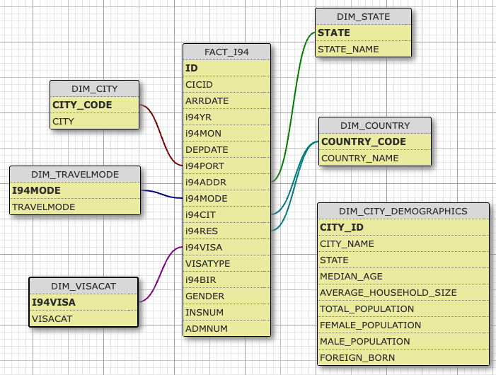

## Data Engineering Capstone Project

### Introduction
This project is the final project of my *[Udacity Nanodegree in Data Engineering](https://www.udacity.com/course/data-engineer-nanodegree--nd027)*.

### The Task
This project processes several data sets on US Immigration, US City Demographics, Airports, and Global Temperature. The goal is to prepare the data and save it in a data warehouse as a source for a Data Analyst or Data Scientist to do further analysis. 

The goal would be to find any correlations between the i94 immigration data, e.g. *visa type*, *visa category*, or *age* and the destination city demographic data like *median age*, *average houshold income*, or *gender distribution*.

### The Datasets
1. **I94 Immigration Data**
This data comes from the [US National Tourism and Trade Office](https://www.trade.gov/national-travel-and-tourism-office). It contains records about U.S. immigration including flight data, visa status, and personal details.

2. **U.S. City Demographic Data**
This data comes from [OpenSoft](https://public.opendatasoft.com/explore/dataset/us-cities-demographics/export/). This dataset contains information about the demographics of all US cities and census-designated places with a population greater or equal to 65,000. This data comes from the US Census Bureau's 2015 American Community Survey.
<!---
3. **World Temperature Data**
This dataset came from [Kaggle](https://www.kaggle.com/datasets/berkeleyearth/climate-change-earth-surface-temperature-data). Kaggle has repackaged the data from a compilation put together by the [Berkeley Earth](http://berkeleyearth.org/about/), which is affiliated with Lawrence Berkeley National Laboratory. The Berkeley Earth Surface Temperature Study combines 1.6 billion temperature reports from 16 pre-existing archives. The data set used here is the Global Land Temperatur By City.

4. **Airport Codes**
This is a simple table of airport codes and corresponding cities provided by [Data Hub](https://datahub.io/core/airport-codes#data). The airport codes may refer to either IATA airport code, a three-letter code which is used in passenger reservation, ticketing and baggage-handling systems, or the ICAO airport code which is a four letter code used by ATC systems and for airports that do not have an IATA airport code (from wikipedia).
-->

### The Data Schema

The data is modeled after the star schema. [The Star Schema](https://en.wikipedia.org/wiki/Star_schema) separates business process data into facts, which hold the measurable, quantitative data about a business, and dimensions which are descriptive attributes related to fact data. 

The tables are displayed in the following image:

### The Project Files

- `CapstoneProject.ipynb` contains all code data exploration and preparation for the etl and data_checks pipelines.
- `etl.py` contains pipeline code to extract the data files, process them via Spark and pandas, and write them back to a data storage using the parquet format

### Project Steps and how to run the project 

- execute `etl.py` to extract, process (transform), and load the data.

### Data Dictionary

FACT_i94
- **id**: Primary key
- **cicid**: CIC identification number
- **arrdate**: arrival date
- **i94yr**: year of arrival
- **i94mon**: month of arrival
- **depdate**: departure date
- **i94port**: port of entry (city and state)
- **i94addr**: state during stay
- **i94mode**: travel method code
- **i94cit**: citizenship country code
- **i94res**: residency country code
- **i94visa**: visa category code
- **visatype**: visa type
- **i94bir**: age at entry
- **gender**: gender
- **insnum**: INS number
- **admnum**: admission number

DIM_CITY
- **city_code**: 3-character country code for port of entry found in i94port
- **city**: corresponding city name

DIM_STATE
- **state**: 2-character state abbreviation found in i94addr
- **state_name**: corresponding state name

DIM_COUNTRY
- **country_code**: 3-digit country code, found in i94cit and i94res
- **country_name**: corresponding country name

DIM_TRAVELMODE
- **i94mode**: 1-digit code referring to the mean of travel, found in i94cit and i94res
- **travelmode**: corresponding name (e.g. "Air")

DIM_VISACAT
- **i94visa**: 1-digit code referring to the visa category, found in i94cit and i94res
- **visacat**: corresponding visa category (e.g. "Business")

DIM_DEMOGRAPHICS
- **city_id**: primary key
- **city_name**: name of the city
- **state**: name of the state
- **median_age**: the median age of the cities population
- **average_houshold_income**: the cities average household income
- **total_population**: the cities total population
- **female_population**: the cities female population
- **male_population**: the cities male population
- **foreign_born**: number of people born in a foreign country 

### Different Scenarios

1. **If the data was increased by 100x**: I would move the parquet storage to an S3 bucket in the cloud with scalable data storage.
2. **If the data populates a dashboard that must be updated on a daily basis by 7am every day**: I would move the pipeline to Airflow, and set a schedule to have it run every morning to update the dashboard.
3. **If the database needed to be accessed by 100+ people**: Like for point 1, moving the storage to an S3 bucket would be sufficient to enable high scale and frequent access.
